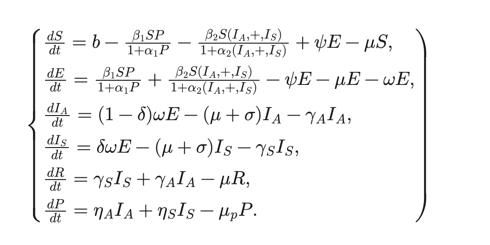

# Interactive SEIR model for COVID-19 (Shiny app)
Pranav Gundrala
PHP1650

### INTRODUCTION

A SEIR (susceptible-exposed-infected-recovered) model is an epidemiological model that tracks the spread of a disease over a population based on various factors. It defines individuals in a population of N in one of four states: 

**Susceptible**, for a person who has not been exposed to the pathogen, 

**Exposed**, denoting a person who has come into contact with the pathogen, taken it up, and is now experiencing a “non-trivial incubation period” during which they have not developed a true infection (Hou, 2024), 

**Infected**, for a person who is currently infected and able to spread the disease, and 

**Recovered**, for any persons who have endured the course of the disease (which includes those who have died from infection) and can no longer be infected. 

This model was used heavily in studying the dynamics of the COVID-19 pandemic. The paper by Mwalili et. al describes a particularly interesting SEIR model that has a few key differences:

Their model presumes different states for either symptomatic infection (Is) or asymptomatic infection (Is), and assigns different parameters (an asymptomatic individual might interact with others more than a symptomatic person, for example).

Their model includes a new compartment (P, for Pathogen) that models pathogens that are deposited in some “shared” environment that is regularly interacted with (i.e. school, work, grocery stores). Exposures (S to E) can arise from this interaction as well.

The transition from S to E after exposure to the pathogen is not unidirectional. It is possible for an individual to not progress from E to Ia/s and instead return to S based on some “robust immune” response.

### SIMULATION

Based on the methods described by Mwalili et. al, a set of differential equations was defined for each of the six states: `S(t)`, `E(t)`, `Ia(t)`, `Is(t)`, `R(t)`, and `P(t)`. 

These were coded into R using the deSolve package and solved at various time intervals from 0 to 150 days. The original parameters were set using those described by Mwalili et. al. The initial values for the model were set for a population of 1M, where `S(0) = 999999` and `E(0) = 1` (patient-zero).

### FEATURES

The shiny app for this simulation can be found here:
[https://pgundral.shinyapps.io/shiny_simul/]

The app contains a homepage from which the user can interact with all of the parameters for the model in a sidebar panel, with various sections depending on the compartment that they interact with. A set of example interventions is also provided that can be toggled on and off, and scale certain parameters based on the model (described on the second page). Tooltips appear to help guide the user. 

This project mainly focuses its efforts on creative and interesting displays of the data and user experience, since SEIR model curves are inherently simple to interpret. Extra functions are implemented to animate the data, and allow ease of use by automatically switching tabs, displaying results, and providing progress updates, to allow the user to interact with and understand their changes to the model:

The default plot using the published parameters is automatically generated and displayed to the right, which can be easily accessed for comparison. 

Once the user presses the `REPLOT` button, the second plot window is automatically opened, and a progress bar is displayed, before the new plot is generated. These plots are created using the `plotly` package in R, and extra calculations are performed to give them interactive and animated functionality (the user can hit `play` or trace through the simulation by time). The plot inherently has extra functions to allow the user to isolate individual traces or display selected ones, rescale axes and zoom into results, and export the plot as a .png file. 

On the second page that can be navigated to from the bar at the top of the site, a series of tabs explains to the user the underlying model and significance of the results. This can allow the user to return to the original page and compare the default and generated plot, or create their own “interventions” by updating parameters. 

A light/dark mode button is also present on the navigation bar for preference/readability. 

### REFERENCES

Hou, Yingze, and Hoda Bidkhori. “Multi-feature SEIR model for epidemic analysis and vaccine prioritization.” PloS one vol. 19,3 e0298932. 1 Mar. 2024, doi:10.1371/journal.pone.0298932

Mwalili, Samuel et al. “SEIR model for COVID-19 dynamics incorporating the environment and social distancing.” BMC research notes vol. 13,1 352. 23 Jul. 2020, doi:10.1186/s13104-020-05192-1
